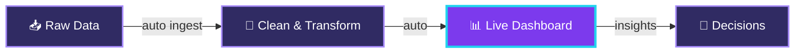

<div align="center">

<!-- ═════════ ANIMATED HEADER ═════════ -->


<!-- ═════════ PROFILE PHOTO (circle) ═════════
     Abhi GitHub avatar use ho raha hai. Apni photo lagane ke liye niche wale
     "url=" ko apni photo ke link se replace karo (steps chat me bataye hain). -->


<!-- ═════════ TYPING ANIMATION ═════════ -->
<a href="https://git.io/typing-svg">
  
</a>

<!-- ═════════ LINKS ═════════ -->
<a href="https://www.linkedin.com/in/pushpender-mishra-230134296/"></a>
<a href="mailto:pushpendermishra01@gmail.com"></a>
<a href="https://github.com/pushpender1043"></a>
<a href="https://leetcode.com/u/pushpender_1043/"></a>
<a href="https://huggingface.co/pushpender1043"></a>

<br/><br/>


</div>

<br/>


```js
const pushpender = {
  role:       ["Full-Stack Engineer", "Generative AI Developer"],
  experience: "Ex-Intern @ Bharti Airtel (2026)",
  building:   ["Growtix", "AgroTech", "DATX"],
  stack:      ["MERN", "Next.js", "AI APIs"],
  workflow:   "AI-native → agents, prompts & copilots",
  wins:       "Hackforge 2.0 🏆",
  motto:      "Turning ideas into shipped products 🔥",
};
```

<br/>


<div align="center">


</div>

<!-- Yaha 2-3 line apne role / kaam ke likh sakte ho -->

<br/>


<div align="center">


</div>



> **DATX** takes raw data, cleans it and keeps the insights live on a dashboard, so nobody has to build reports by hand.

<!-- Jab ready ho to link add karo:
<a href="REPO_LINK"></a>
<a href="LIVE_LINK"></a>
-->

<br/>


<div align="center">

<table>
  <tr>
    <td align="center" width="50%">
      <h3>🌱 Growtix</h3>
      
    </td>
    <td align="center" width="50%">
      <h3>🌾 AgroTech</h3>
      
    </td>
  </tr>
</table>

</div>

<br/>


<div align="center">


<br/>


<br/><br/>


</div>

<br/>


<div align="center">


<br/>


</div>

<br/>


<div align="center">


</div>

<br/>

<div align="center">


<a href="mailto:pushpendermishra01@gmail.com"></a>
<a href="https://www.linkedin.com/in/pushpender-mishra-230134296/"></a>


</div>
